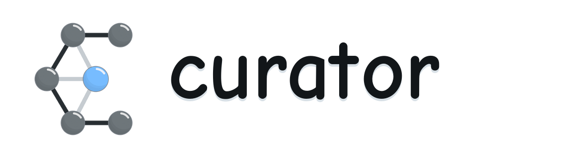

<p align="center">
  
</p>

<p align="center">
  <strong>Active learning for machine-learned interatomic potentials.</strong>
  <br>
  Train, explore, select, label, evaluate, and deploy from one modular toolkit.
</p>

<p align="center">
  <a href="https://pypi.org/project/curator-torch/"></a>
  <a href="https://curator-gnn.readthedocs.io/en/latest/"></a>
  <a href="LICENSE"></a>
  <a href="https://doi.org/10.26434/chemrxiv-2024-p5t3l"></a>
</p>

<p align="center">
  <a href="#why-curator">Why CURATOR</a> ·
  <a href="#installation">Installation</a> ·
  <a href="#quick-start">Quick start</a> ·
  <a href="#command-line-tools">CLI</a> ·
  <a href="#configuration-and-outputs">Configuration</a> ·
  <a href="#citation">Citation</a>
</p>

---

CURATOR is a config-driven framework for building robust machine-learned interatomic potentials (MLIPs). It brings equivariant neural networks, atomistic simulation, uncertainty-aware batch selection, first-principles labeling, evaluation, and deployment into a single workflow.

<p align="center">
  <b>Reference data</b> &nbsp;→&nbsp; <b>Train</b> &nbsp;→&nbsp; <b>Simulate</b> &nbsp;→&nbsp; <b>Select</b> &nbsp;→&nbsp; <b>Label</b> &nbsp;↺
  <br>
  <sub>Evaluate throughout the loop · Deploy when the potential is ready</sub>
</p>

Every stage can run independently, while [MyQueue](https://myqueue.readthedocs.io/) can connect the stages into autonomous, iteration-aware HPC workflows.

## Why CURATOR

| | What CURATOR provides |
|---|---|
| **Models** | Native [PaiNN](https://arxiv.org/abs/2102.03150), [NequIP](https://arxiv.org/abs/2101.03164), and [MACE](https://arxiv.org/abs/2206.07697) representations; trainable Allegro and eSEN backbone wrappers; external model adapters for MACE, NequIP, Allegro, MatGL, and eSEN. |
| **Training** | PyTorch Lightning training, distributed execution, energy/force/virial objectives, multi-domain datasets, full/head-only/LoRA fine-tuning, and teacher distillation with Hessian-aware objectives. |
| **Exploration** | ASE molecular dynamics, geometry optimization and NEB, plus TorchSim and LAMMPS execution paths. |
| **Uncertainty** | Ensemble and Mahalanobis uncertainty, uncertainty-aware simulation callbacks, and early stopping for out-of-domain structures. |
| **Selection** | Gradient and latent-feature kernels with max-diagonal, max-distance, max-determinant, LCMD, deterministic CUR, and DIRECT/BIRCH batch selection. |
| **Labeling** | Configurable VASP and GPAW annotators, split labeling jobs, ASE database tracking, and automatic dataset append. |
| **Evaluation** | Energy/force metrics, parity plots, error histograms, raw prediction export, and single-model or ensemble evaluation. |
| **Deployment** | TorchScript and LAMMPS ML-IAP export, uncertainty-enabled ensembles, e3nn ↔ cuEquivariance conversion, MACE interoperability, and checkpoint upgrades. |

CURATOR keeps these capabilities composable through [Hydra](https://hydra.cc/) configuration. Swap a representation, simulator, uncertainty method, optimizer, or fine-tuning policy without rewriting the pipeline.

## Installation

Install PyTorch for the CPU or CUDA environment you intend to use, following the [official PyTorch instructions](https://pytorch.org/get-started/locally/), then install CURATOR.

### Stable release

```bash
python -m pip install --upgrade pip
python -m pip install curator-torch
```

### Latest development version

```bash
git clone https://github.com/Yangxinsix/curator.git
cd curator
python -m pip install -e .
```

For the current development branch, Python 3.10 or newer is recommended.

### Optional extras

| Extra | Install command | Adds |
|---|---|---|
| Optimized neighbors | `python -m pip install "curator-torch[opt]"` | `torch-scatter`, ASAP3, and matscipy |
| cuEquivariance | `python -m pip install "curator-torch[cueq]"` | NVIDIA cuEquivariance acceleration |
| TorchSim | `python -m pip install "curator-torch[torchsim]"` | TorchSim simulation backend |

> [!NOTE]
> GPU packages are platform-specific. Confirm that the PyTorch, CUDA, and cuEquivariance builds are compatible before installing acceleration extras.

## Quick start

### 1. Evaluate the included LiFePO₄ model

The repository includes a small dataset and checkpoint, so you can verify an installation without training first:

```bash
curator-evaluate \
  --data example/LiFePO4.traj \
  --model example/best_model.ckpt \
  --device cpu \
  --out runs/evaluate
```

Metrics and plots are written to `runs/evaluate/LiFePO4/`:

```text
runs/evaluate/LiFePO4/
├── metrics.json
├── parity_energy.png
├── parity_forces_xyz.png
├── hist_energy_error.png
├── hist_force_error_norm.png
└── bar_force_mae_by_element.png
```

Add `--save-data` to also write `results.npz`, or `--no-plot` for metrics-only evaluation.

### 2. Train the included example

```bash
cd example/train
curator-train cfg=config.yaml
```

Before a production run, review `data.datapath`, `device`, batch size, precision, and `trainer.max_epochs` in the config. Training writes the resolved config, log, checkpoints, and deployable model into `run_path`.

### 3. Run the active-learning stages

Each stage consumes a YAML config and hands an artifact to the next stage:

```bash
curator-train    cfg=train.yaml
curator-simulate cfg=simulate.yaml
curator-select   cfg=select.yaml
curator-label    cfg=label.yaml
```

```text
dataset ──▶ train ──▶ model ──▶ simulate ──▶ pool ──▶ select ──▶ indices
   ▲                                                                  │
   └──────────────────────────── label ◀──────────────────────────────┘
```

Ready-to-edit examples live in [`example/`](example/), while reusable defaults and component groups live in [`curator/configs/`](curator/configs/).

## Command-line tools

Installing CURATOR provides the following commands:

| Command | Purpose |
|---|---|
| `curator-train` | Train, resume, or fine-tune a potential; optionally deploy the best checkpoint. |
| `curator-simulate` | Run configured MD, optimization, NEB, TorchSim, or LAMMPS exploration. |
| `curator-select` | Compute features and select an informative batch from a structure pool. |
| `curator-label` | Label selected structures with a configured electronic-structure calculator. |
| `curator-evaluate` | Evaluate checkpoints or ensembles and export metrics, plots, and predictions. |
| `curator-deploy` | Export TorchScript or LAMMPS ML-IAP models, including uncertainty-aware ensembles. |
| `curator-convert` | Upgrade checkpoints or convert model backends, formats, and domain structure. |
| `curator-workflow` | Submit the iterative pipeline through MyQueue. |

Two useful post-training commands are:

```bash
# Export a TorchScript model
curator-deploy model.ckpt --target_path compiled_model.pt

# Export a LAMMPS ML-IAP model
curator-deploy model.ckpt --mliap \
  --element-types Fe Li O P \
  --target_path mliap_model.pt
```

Run any command with `--help` for its current options. Hydra-driven commands also accept direct overrides such as `device=cpu`, `run_path=runs/train`, or `trainer.max_epochs=10`.

## Configuration and outputs

CURATOR composes package defaults with a user YAML supplied through `cfg=<path>`. The resolved configuration is saved beside the run artifacts, so every experiment remains inspectable and reproducible.

| Stage | Main inputs | Default run artifacts |
|---|---|---|
| Train | Dataset, representation, task, trainer | `training.log`, `config.yaml`, `model_path/`, `compiled_model.pt` |
| Simulate | Model, initial structures, simulator | `simulation.log`, `config.yaml`, trajectories and warning structures |
| Select | Model, pool, optional training set | `selection.log`, `config.yaml`, `selected.json`, optional feature stores and `selected.traj` |
| Label | Pool, selected indices, annotator | `labelling.log`, `config.yaml`, `dft_structures.db`, appended dataset |
| Evaluate | Model or ensemble, labeled dataset | `predict.log`, per-dataset `metrics.json`, plots, optional `results.npz` |

The most important component groups are:

```text
curator/configs/
├── model/representation/   # PaiNN, NequIP, MACE, Allegro, eSEN
├── data/                   # single- and multi-domain datasets
├── finetune/               # full, head-only, LoRA
├── simulator/              # engines, callbacks, uncertainty
├── task/                   # objectives, optimizers, schedulers
├── trainer/                # Lightning runtime, logging, callbacks
└── annotator/              # VASP and GPAW labeling
```

## Interfaces and documentation

- [Documentation](https://curator-gnn.readthedocs.io/en/latest/)
- [Training tutorial](https://curator-gnn.readthedocs.io/en/latest/tutorials/training.html)
- [LAMMPS interface guide](interface/README.md)
- [LAMMPS ML-IAP documentation](docs/source/interface/lammps_mliap.rst)
- [OpenMM interface notes](docs/source/interface/openmm.rst)
- [Example configurations and notebooks](example/)

Found a bug or have an idea for a new model, simulator, selector, or annotator? Please [open an issue](https://github.com/Yangxinsix/curator/issues).

## Citation

If CURATOR contributes to your research, please cite the [CURATOR preprint](https://doi.org/10.26434/chemrxiv-2024-p5t3l):

```bibtex
@article{yang2024curator,
  title   = {CURATOR: Building Robust Machine Learning Potentials for Atomistic
             Simulations Autonomously with Batch Active Learning},
  author  = {Yang, Xin and Petersen, Martin Hoffmann and Sechi, Renata and others},
  journal = {ChemRxiv},
  year    = {2024},
  doi     = {10.26434/chemrxiv-2024-p5t3l}
}
```

## License

CURATOR is distributed under the [MIT License](LICENSE). Copyright © 2024 Technical University of Denmark.
