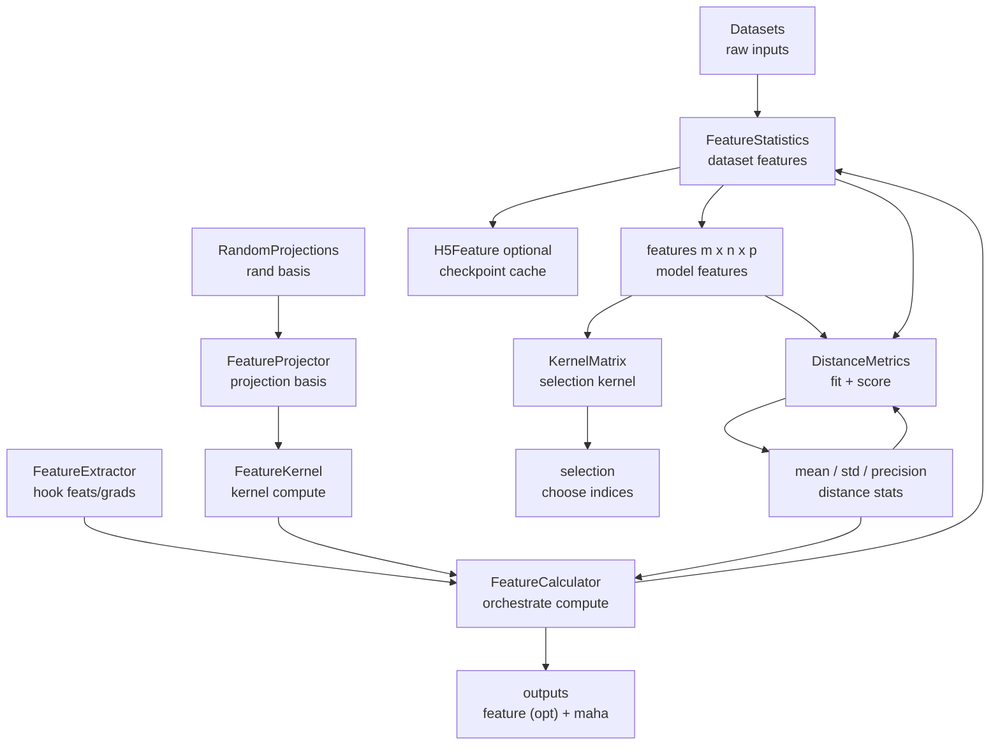

# curator/select overview

This folder contains the feature extraction, kernel construction, and selection
utilities used for active learning and uncertainty workflows.

## Core classes

### FeatureExtractor (`curator/layer/_feature.py`)
- Purpose: attach hooks to a target layer and collect per-layer features/gradients.
- Input/Output: consumes a batch dict and writes `properties.feature` and
  `properties.gradient` into it.
- Notes: can be attached to a model via `register_repr_callback`.

### FeatureProjector / RandomProjections (`curator/layer/_feature.py`)
- Purpose: define a projection for feature/gradient pairs.
- RandomProjections creates Gaussian projection buffers per linear-like layer.

### FeatureKernel (`curator/layer/_feature.py`)
- Purpose: compute a single kernel feature from `(image_idx, feats, grads)`.
- Supports global and local variants (e.g. `full-gradient` vs `local_full-gradient`).

### FeatureCalculator (`curator/layer/_feature.py`)
- Purpose: orchestrate extraction and kernel computation.
- Two modes:
  - Attached to a model via `output_modules`: forward uses already-captured hooks.
  - Standalone: `compute(..., predict=True)` triggers model forward.
- Output control: `output_features=False` suppresses `properties.feature` to reduce memory.
- Can emit `properties.maha_dist` when distance buffers are registered.
- `distance_kernel` chooses which kernel to use for distance (default: first kernel).

### H5Feature (`curator/layer/_feature.py`)
- Purpose: append-only HDF5 cache for features, counts, and `image_idx`.
- Shape: per kernel datasets stored as `(num_models, n, n_features)`.
- Used for checkpoint/resume and large datasets.

### FeatureStatistics (`curator/layer/_feature.py`)
- Purpose: compute features for a dataset using one or more FeatureCalculators.
- Supports:
  - Multiple kernels per forward.
  - Multiple models (features shape `m x n x p`).
  - HDF5 checkpointing via H5Feature.
  - Optional normalization.
- Uses `FeatureCalculator.compute(...)` directly, so it still returns features even if
  a calculator has `output_features=False` for inference.

### DistanceMetrics (`curator/layer/_feature.py`)
- Purpose: compute distance statistics from feature tensors (mean/std/precision).
- Fit/score works on feature arrays only; this class has no kernel awareness.
- Provides Mahalanobis plus Euclidean/Cosine helpers for quick scoring.

### GeneralActiveLearning (`curator/select/active_learning.py`)
- Purpose: end-to-end flow: compute features -> build kernel matrix -> select indices.
- Accepts pool/train sets and optional filtering.

## Kernel and selection utilities

### KernelMatrix hierarchy (kernel.py)
- `KernelMatrix`: interface for kernel matrix access.
- `FeatureKernelMatrix`: dense kernel from feature tensor (`m x n x p`).
- `DiagonalKernelMatrix`: diagonal-only kernel (e.g. uncertainty scores).
- `FeatureCovKernelMatrix`: kernel with covariance weighting.

### Selection algorithms (select.py)
- `max_diag`, `max_dist_greedy`, `max_det_greedy`, `lcmd_greedy`, etc.
- Each consumes a KernelMatrix and returns selected indices.

## Filters (filter.py)
- `Filter` base class with `filter_dataset`.
- `ElementFilter`, `ForceFilter` implement dataset subsetting.
- Used in GeneralActiveLearning to filter pool data before selection.

## How classes interact

### Relationship diagram (Mermaid)

### Feature flow
1. `FeatureExtractor` hooks the target layer and collects `(feats, grads)`.
2. `FeatureKernel` converts those into a single kernel feature.
3. `FeatureCalculator` runs extract + kernel compute for one or more kernels.
4. `FeatureStatistics` runs FeatureCalculator over datasets and models.
5. `H5Feature` stores features and `image_idx` if checkpointing is enabled.

### Active learning flow
1. `GeneralActiveLearning.select(...)` builds FeatureStatistics for pool/train.
2. Features become a KernelMatrix (FeatureKernelMatrix or DiagonalKernelMatrix).
3. A selection method in `select.py` picks indices.

### Distance flow (Mahalanobis)
1. `FeatureStatistics` computes features on the training set.
2. `DistanceMetrics` computes mean/std/precision from those features.
3. `FeatureCalculator` can use these buffers to output `properties.maha_dist`
   during forward (when configured). Feature output is optional via `output_features`.

## Recommended usage patterns

### Compute features for a dataset
- Use `FeatureStatistics` with a list of models and desired kernels.
- Enable H5Feature if the dataset is large or you need resume.

### Active learning selection
- Use `GeneralActiveLearning` with pool/train sets.
- Choose a kernel and selection method; optionally filter the pool set.

### Add distance outputs to a model
- Attach a configured `FeatureCalculator` to `model.output_modules`.
- Compute distance statistics once (via `DistanceMetrics`) and register buffers.
- Subsequent forwards can emit `properties.maha_dist`.
